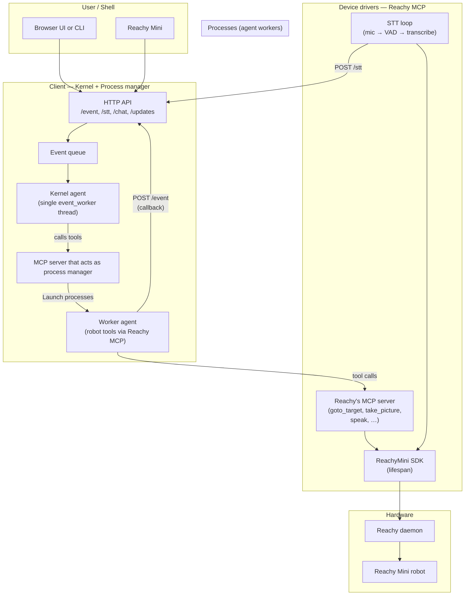

# rosaOS architecture (OS-style)

High-level layout with operating-system analogies: kernel, process manager, processes, and device layer.

## Flow summary

| Step | What happens |
|------|----------------|
| 1 | User speaks → Reachy mic → STT loop transcribes → POST `/stt` → event queue. |
| 2 | Kernel agent consumes event (e.g. `[User said] ...`), calls `launch_process(system_prompt)` on process server. |
| 3 | Process server spawns worker subprocess; worker runs process agent with robot MCP tools. |
| 4 | Worker uses tools (e.g. `speak`, `take_picture`) → Reachy MCP server → ReachyMini → daemon/robot. |
| 5 | Worker finishes → POST `/event` to kernel with `worker_id`, `message`, `done` → kernel gets `[Worker callback]` event. |
| 6 | Kernel may launch another process (e.g. to speak to user). |

## Ports

| Port | Service | Role |
|------|---------|------|
| 8000 | Reachy Mini daemon | Robot control (external) |
| 5001 | Reachy MCP server | Device layer: robot tools + STT loop |
| 7001 | Process server (MCP) | Internal process manager |
| 8765 | Client (FastAPI) | Kernel + HTTP API (event, stt, chat, updates) |
| 6000 | vLLM (optional) | Local LLM endpoint |
